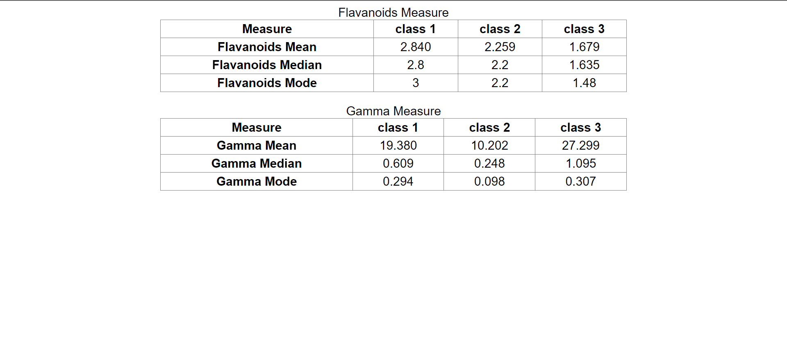

Welcome to the Project repository! This document will guide you through the steps to clone the repository, open it in your preferred code editor, and run the application using npm.

Prerequisites
-------------

Before you begin, make sure you have the following installed on your machine:

-   [Git](https://git-scm.com/)
-   [Node.js](https://nodejs.org/)

Clone the Repository
--------------------

To get started, clone this repository to your local machine using the following command:

bashCopy code

`git clone https://github.com/Shivu150199/Wine-set.git`

Navigate to the Project Directory
---------------------------------

Once the cloning process is complete, navigate to the project directory using the `cd` command:

bashCopy code

`cd Wine-set`

Open in Code Editor
-------------------

Open the project in your preferred code editor. If you don't have a code editor installed, you can download and install one of the following:

-   Visual Studio Code
-   [Atom](https://atom.io/)
-   [Sublime Text](https://www.sublimetext.com/)

Use the command specific to your code editor to open the project. For example, with Visual Studio Code:

bashCopy code

`code .`

Install Dependencies
--------------------

To install the project dependencies, run the following command in the terminal:

bashCopy code

`npm install`

This command will install all the required packages and dependencies specified in the `package.json` file.

Run the Application
-------------------

Once the dependencies are installed, you can start the application using the following command:

bashCopy code

`npm start`

This command will start the development server, and you should be able to access the application in your web browser at http://localhost:3000.

Congratulations! You have successfully cloned the repository, opened it in your code editor, installed the dependencies, and run the application. 

`screen shot of tables`
